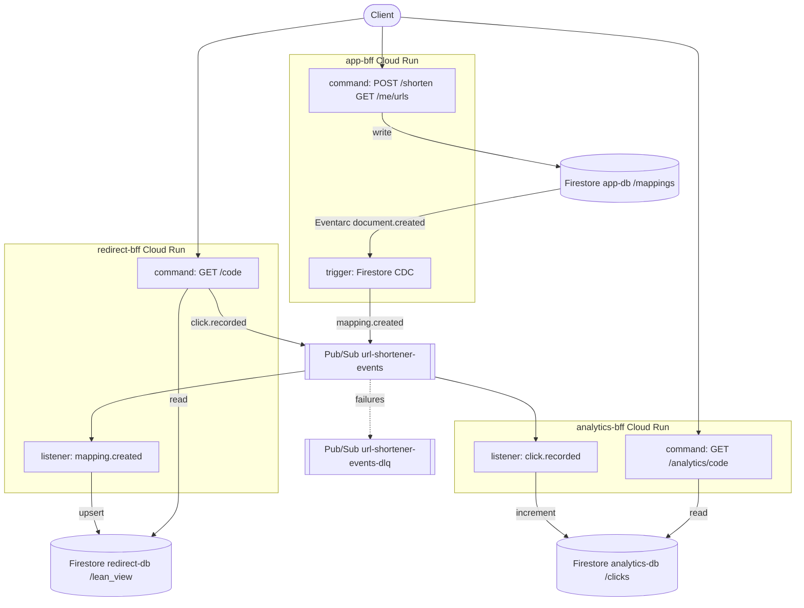

# url-shortener-app-gcp

GCP port of the AWS serverless URL shortener
(`/opt/data/serverless/url-shortener-app/`). Same product, same
event-sourced / CQRS shape, ported to Google Cloud.

**Read [`BRAINSTORM.md`](./BRAINSTORM.md) first** — it is the design
source of truth (primitive map, event flow, risks, decisions).

## Architecture

Database-first CQRS: the **command** leg writes Firestore; the
**trigger** leg (Firestore Eventarc CDC) is the sole producer of
`mapping.created`; **listeners** materialize lean views / analytics
from the Pub/Sub bus.



| BFF | Command | Trigger (CDC) | Listener (bus) |
|-----|---------|---------------|----------------|
| `app-bff` | write/list mappings | Firestore → `mapping.created` | — |
| `redirect-bff` | 302 + emit `click.recorded` | — | `mapping.created` → lean_view |
| `analytics-bff` | owner-only click count | — | `click.recorded` → clicks |

## Quickstart

Prereqs: Node 20+, Terraform 1.5+, `gcloud` authenticated (ADC), a GCP
project with billing enabled and the APIs from BRAINSTORM §1 enabled.

```bash
npm install
npx nx run-many -t build
npx nx run-many -t typecheck
```

## Deploy the stack to GCP

Deployment is two layers:

1. **Terraform** — event hub, Firestore DBs, Cloud Run services, Eventarc, IAM, secrets
2. **Nx BFF deploy** — Cloud Build → Artifact Registry → pin Cloud Run to that image digest

Default project / region used by scripts: `serverless-503308` /
`asia-southeast1`.

### Auth

```bash
export GOOGLE_APPLICATION_CREDENTIALS=/path/to/application_default_credentials.json
export CLOUDSDK_AUTH_ACCESS_TOKEN="$(gcloud auth application-default print-access-token)"
export CLOUDSDK_CORE_PROJECT=serverless-503308
gcloud config set project serverless-503308
```

### 1) Infrastructure (Terraform)

From `terraform/envs/dev` (plan → review → apply):

```bash
cd terraform/envs/dev

# Ensure tfvars exist (smoke key, project_id, etc.). Do not commit secrets.
# Example keys: project_id, region, smoke_test_key

terraform init -input=false
terraform plan -input=false -out=./dev.tfplan
# Review the plan, then:
terraform apply -input=false ./dev.tfplan

terraform output
```

Useful outputs: `app_bff_url`, `redirect_bff_url`, `analytics_bff_url`,
`events_topic_name`, `events_dlq_topic_name`.

First apply creates Cloud Run services (often with a placeholder / prior
image). Eventarc Firestore → app-bff and bus → redirect/analytics
triggers are wired here.

### 2) Application images (Nx / Cloud Build)

Build, push, and pin each BFF to the digest from **that** Cloud Build
(not mutable `:latest`):

```bash
# from repo root
npx nx run app-bff:deploy
npx nx run redirect-bff:deploy
npx nx run analytics-bff:deploy

# or sequentially:
npx nx run-many -t deploy -p app-bff,redirect-bff,analytics-bff --parallel=1
```

Under the hood: `scripts/deploy-bff.sh` → `gcloud builds submit` with
`terraform/scripts/cloudbuild.yaml` → `gcloud run services update …@sha256:…`.

### 3) Smoke / E2E

Local (ADC + smoke header):

```bash
SMOKE_TEST_KEY=dev-smoke-key-change-me ./scripts/smoke-bff.sh
```

From Google Cloud Shell, use the same flow with
`gcloud auth print-identity-token` + `X-Smoke-Test` (Cloud Run needs an
identity token, not an opaque access token).

Expected path:

`POST /shorten` → wait for Eventarc → `GET /{code}` 302 →
`GET /analytics/{code}` with `count >= 1`.

### Redeploy after code changes

Infra unchanged → only step 2:

```bash
npx nx run-many -t deploy -p app-bff,redirect-bff,analytics-bff --parallel=1
```

IAM / Eventarc / env / secret changes → Terraform plan/apply, then
redeploy BFFs if the image must pick up new runtime code.

## Service URLs (after apply)

| Output | Purpose |
|--------|---------|
| `app_bff_url` | `POST /shorten`, `GET /me/urls` (auth) |
| `redirect_bff_url` | `GET /{code}` → 302 |
| `analytics_bff_url` | `GET /analytics/{code}` (auth, owner-only) |
| `events_topic_name` | bus topic |
| `events_dlq_topic_name` | DLQ topic |

Resolve live URLs anytime:

```bash
gcloud run services describe app-bff --region=asia-southeast1 --format='value(status.url)'
gcloud run services describe redirect-bff --region=asia-southeast1 --format='value(status.url)'
gcloud run services describe analytics-bff --region=asia-southeast1 --format='value(status.url)'
```

## Layout

| Path | What lives there |
|------|------------------|
| `BRAINSTORM.md` | Design source of truth |
| `AGENTS.md` | AI agent conventions |
| `terraform/modules/` | `event-hub`, `bff-service`, `identity` |
| `terraform/envs/` | per-env composition (`dev`, …) |
| `apps/*-bff/src/` | `index.ts` + `command.ts` + `trigger.ts` / `listener.ts` |
| `libs/` | shared: events, auth, firestore, pubsub, http, proto-decode |
| `scripts/` | `deploy-bff.sh`, `smoke-bff.sh` |

## License

UNLICENSED — private monorepo.
